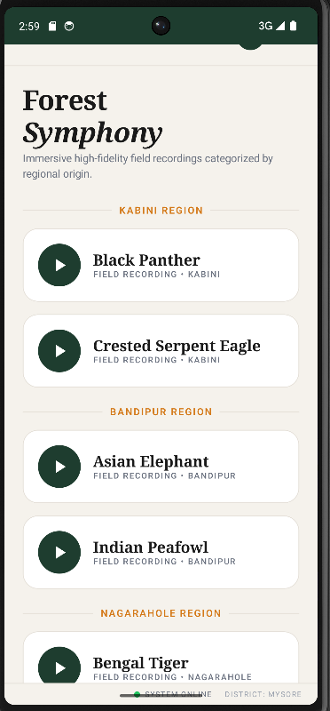

# 🌿 Karunada Vanya — ಕರ್ನಾಡ ವನ್ಯ

A wildlife conservation and farmer safety Android app for Karnataka's forest regions — Nagarahole, Bandipur, and Kabini.

---

## 📱 About the App

Karunada Vanya is a community-focused app designed to bridge the gap between forest departments, farmers, and villagers living near Karnataka's wildlife corridors. It provides real-time wildlife movement alerts, safety guidelines, and educational resources to help communities coexist safely with wildlife.

---
## 📱 App Screenshots

| Home | Navigation Drawer | Wildlife Wiki |
|------|------------------|---------------|
|  |  |  |

| Wiki Flora | Wiki Detail | Movement Alerts |
|------------|-------------|-----------------|
|  |  |  |

| Report Movement | Safety Guide | Forest Audio | Audio Playing |
|----------------|--------------|--------------|---------------|
|  |  |  |  |
---
## ✨ Features

- **🔴 Movement Alerts** — Real-time wildlife sighting reports powered by Firebase Firestore, with automatic 6-hour expiry for accuracy
- **📖 Wildlife Wiki** — Offline encyclopedia of animals, birds, and flora found in Nagarahole, Bandipur, and Kabini
- **🛡️ Safe Guide** — Safety and agriculture tips for farmers and villagers living near forest borders
- **🎵 Forest Audio** — Wildlife sound identification organized by region
- **🌍 Region Filter** — Switch between All Regions, Nagarahole, Bandipur, and Kabini

---

## 🛠️ Tech Stack

| Layer | Technology |
|---|---|
| Language | Kotlin |
| UI Framework | Jetpack Compose + Material 3 |
| Architecture | MVVM + StateFlow |
| Backend | Firebase Firestore (real-time) |
| Min SDK | Android 8.0 (API 26) |
| Build System | Gradle (Kotlin DSL) |

---

## 📂 Project Structure
app/src/main/java/com/example/karunada_vanya/
├── data/
│   ├── model/          # Data classes (WikiItem, MovementAlert, etc.)
│   └── repository/     # Data sources (Wiki, SafeGuide, Audio)
├── ui/
│   ├── components/     # TopBar, DrawerContent, StatusBar
│   ├── screens/        # HomeScreen, WikiScreen, MovementScreen, etc.
│   └── theme/          # Colors, Typography, Theme
├── viewmodel/          # MovementViewModel (Firebase)
├── navigation/         # Screen sealed class
└── MainActivity.kt     # Entry point, responsive layout

---

## 🚀 Getting Started

### Prerequisites
- Android Studio Hedgehog or later
- Android device or emulator (API 26+)
- Firebase project with Firestore enabled

### Setup
1. Clone the repository
```bash
   git clone https://github.com/SahanaGowda-01/KarunadaVanya.git
```
2. Open the project in Android Studio
3. Add your `google-services.json` file to the `app/` directory
4. Build and run the project

---

## 🌱 Regions Covered

- **Nagarahole** National Park
- **Bandipur** Tiger Reserve  
- **Kabini** Wildlife Sanctuary

---

## 🤝 Contributing

Pull requests are welcome. For major changes, please open an issue first to discuss what you would like to change.

---

## 📄 License

This project is open source and available under the [MIT License](LICENSE).

---

*Built with ❤️ for the farming communities of Karnataka*
